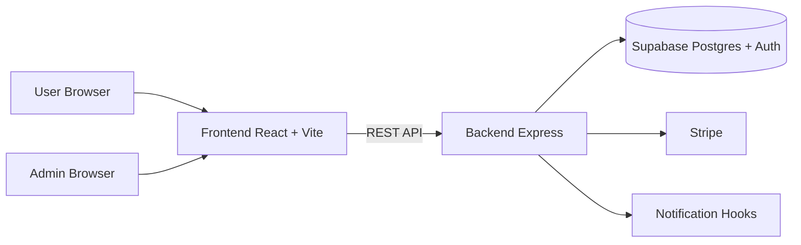
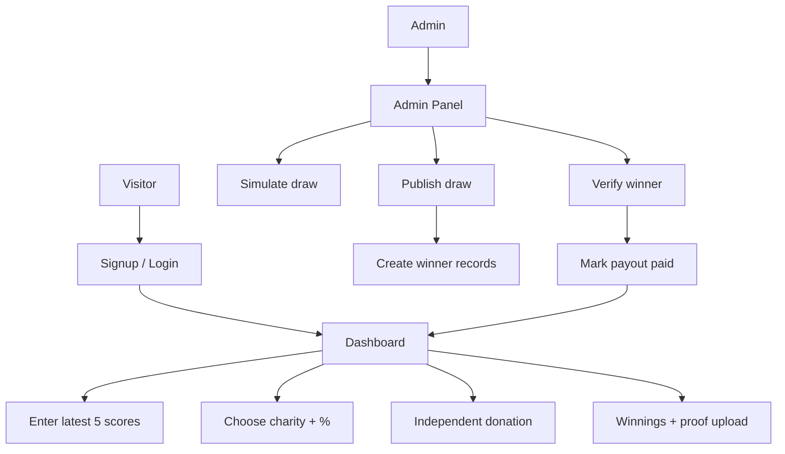

# Golf Charity Subscription Platform

<p align="left">
  <a href="https://github.com/Arbab-ofc/Golf-Charity-Subscription-Platform"></a>
  
  
  
  
  
  
  
</p>

Full-stack monorepo for a subscription golf platform that combines:

- score tracking (latest 5 Stableford scores)
- monthly draw simulation + publishing
- winner verification + payout workflow
- charity selection and independent donations
- admin operations panel

## Live Access

| Service | URL |
|---|---|
| Frontend (Primary) | `https://golf-charity-subscription-platform-hazel.vercel.app` |
| Frontend (Deployment) | `https://golf-charity-subscription-platform-lw7owc1e7.vercel.app` |
| Backend Base | `https://golf-charity-backend-a7mw.onrender.com` |
| Backend Health | `https://golf-charity-backend-a7mw.onrender.com/health` |
| Backend API Base | `https://golf-charity-backend-a7mw.onrender.com/api` |

> Tip: Use the **Primary Frontend URL** for testing and demos.

## GitHub Repository

- Repo URL: `https://github.com/Arbab-ofc/Golf-Charity-Subscription-Platform`
- Clone:

```bash
git clone https://github.com/Arbab-ofc/Golf-Charity-Subscription-Platform.git
cd "Full-stack Golf Charity Platform  "
```

## System Architecture



### Quick Entry Points

- User Dashboard: `https://golf-charity-subscription-platform-hazel.vercel.app/dashboard`
- Admin Panel: `https://golf-charity-subscription-platform-hazel.vercel.app/admin`
- API Health Check: `https://golf-charity-backend-a7mw.onrender.com/health`

## Workflow Map



## Repository Layout

```text
backend/    Express API, services, bootstrap, migrations
frontend/   React app (user + admin interfaces)
shared/     Shared contracts/types (placeholder)
```

## Features Implemented

### Auth and Roles

- JWT-based signup/login
- role-protected routes (`admin`, `user`)
- `me`, refresh, logout, password reset
- signup supports charity selection + percentage

### Subscription

- Stripe checkout session init
- subscription status sync + lifecycle
- merged cancel/remove dashboard action

### Scores

- score range validation (`1-45`)
- latest 5 score retention
- dashboard stats (average, best, rounds)

### Draw Engine

- simulate mode (preview only)
- publish mode (persists draw + winners)
- random and algorithmic draw
- unique match logic (duplicate inflation fixed)
- 5-score eligibility required for participation

### Winners

- user winnings overview
- admin verification + payout actions
- winner proof URL submission by user
- payout guard: must be `approved` before `paid`

### Charities and Donations

- charity listing + my-charity preference
- admin charity CRUD + featured toggle
- independent donation module (`/api/donations`)

### UX Enhancements

- home page redesign with auth-aware CTAs
- admin winner actions hidden by state
- admin winners auto-load without mandatory manual search
- long email masking with partial `...`

## API Groups

- `/api/auth`
- `/api/subscriptions`
- `/api/scores`
- `/api/charities`
- `/api/draws`
- `/api/winners`
- `/api/donations`
- `/api/admin`

## Test Credentials

These are auto-synced/created on backend startup.

### Admin

- Email: `admin@gmail.com`
- Password: `admin@123`
- Access: `/admin`

### User

- Email: `user@gmail.com`
- Password: `User@123`
- Access: `/dashboard`

### Fast Login URLs

- Login: `https://golf-charity-subscription-platform-hazel.vercel.app/login`
- Signup: `https://golf-charity-subscription-platform-hazel.vercel.app/signup`

## Setup Guide

## 1) Install Dependencies

```bash
cd backend
npm install
cd ../frontend
npm install
```

## 2) Configure Environment

### Backend

```bash
cd backend
cp .env.example .env
```

Required/used keys:

- `NODE_ENV`
- `PORT`
- `FRONTEND_URL`
- `JWT_SECRET`
- `JWT_EXPIRES_IN`
- `SUPABASE_URL`
- `SUPABASE_ANON_KEY`
- `SUPABASE_SERVICE_ROLE_KEY`
- `STRIPE_SECRET_KEY`
- `STRIPE_WEBHOOK_SECRET`
- `STRIPE_MONTHLY_PRICE_ID`
- `STRIPE_YEARLY_PRICE_ID`
- `STRIPE_SUCCESS_URL`
- `STRIPE_CANCEL_URL`
- `ENABLE_EMAIL_NOTIFICATIONS` (optional; default `false`)

### Frontend

```bash
cd frontend
cp .env.example .env
```

Keys:

- `VITE_API_URL=http://localhost:4000/api`
- `VITE_STRIPE_PUBLISHABLE_KEY=pk_test_xxx`

## 3) Run Supabase Migrations

In Supabase SQL Editor, run in order:

1. `backend/supabase/migrations/001_init_schema.sql`
2. `backend/supabase/migrations/002_donations.sql`

Then refresh schema cache:

```sql
NOTIFY pgrst, 'reload schema';
```

## 4) Start Services

### Backend

```bash
cd backend
npm run dev
```

### Frontend

```bash
cd frontend
npm run dev
```

Local URLs:

- Frontend: `http://localhost:5173`
- Backend: `http://localhost:4000/api`

## Validation Checklist

1. Login with admin credentials and open `/admin`.
2. Signup user with charity selected.
3. Simulate draw, then publish.
4. Check winner row appears.
5. Submit proof URL from user dashboard.
6. Verify winner in admin, then mark payout paid.
7. Attempt payout before approval (should fail due to guard).
8. Create independent donation and confirm total/history updates.

## Commands

### Backend tests

```bash
cd backend
npm test
```

### Frontend build

```bash
cd frontend
npm run build
```

## Notes

- Notification system is currently hook-based logger adapter; wire SES/SendGrid/Resend for production delivery.
- Stripe integration requires valid keys, product prices, and webhook configuration.
- If table-not-found errors appear, confirm backend `.env` points to the same Supabase project where migrations were executed.
